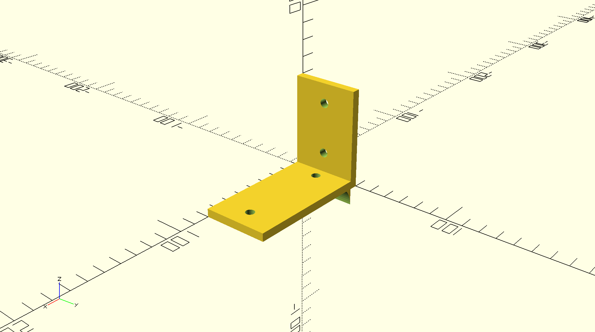
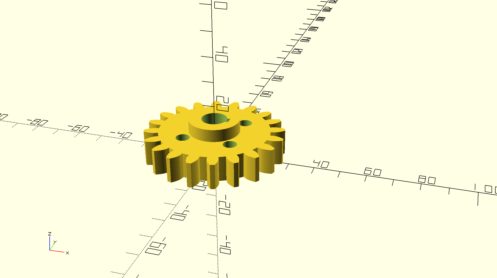
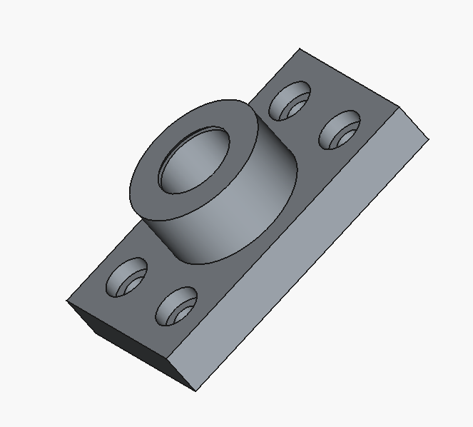
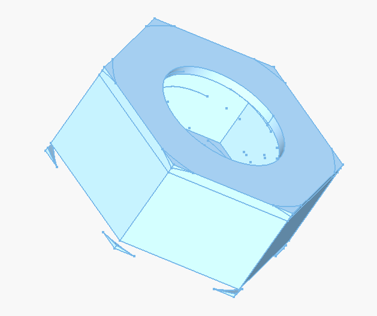
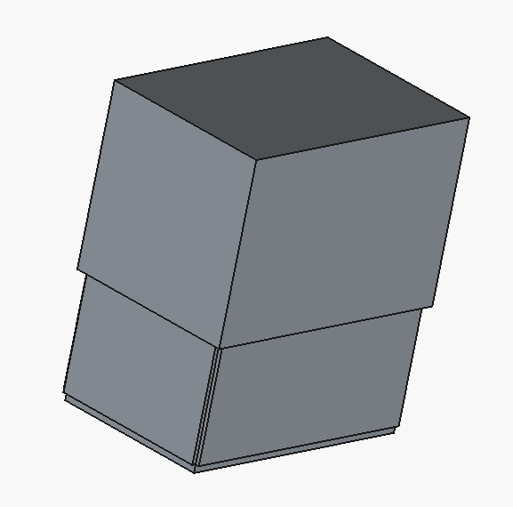
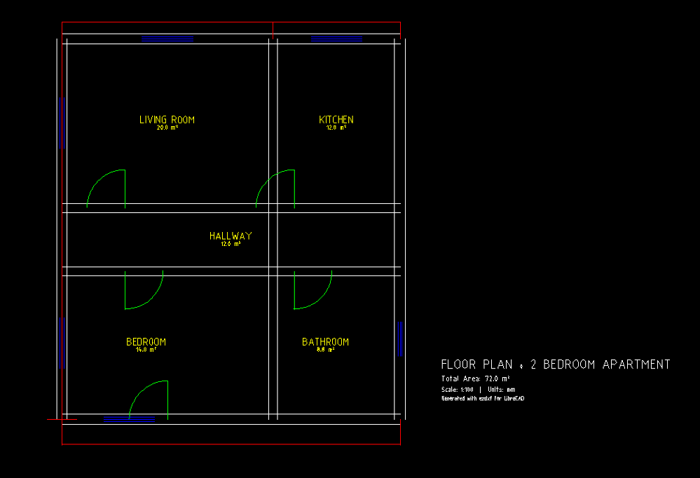
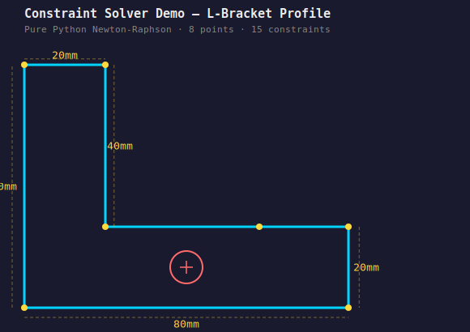

# Open-Source CAD Portfolio

Scripted parametric models demonstrating proficiency with open-source CAD tools. Each project is fully code-defined — no manual GUI clicks required to reproduce the geometry.

## Projects

### [Parametric Mounting Bracket & Spur Gear — OpenSCAD](openscad/)

Pure-code 3D models with all parameters exposed via OpenSCAD's Customizer. The bracket features mounting holes, fillets, and gusset reinforcement. The gear uses involute tooth profiles with configurable module, bore, and keyway.

| Parametric Bracket | Spur Gear |
|---|---|
|  |  |

### [Bearing Block & Hex Nut — FreeCAD Python](freecad/)

Mechanical parts scripted via FreeCAD's Python API. The bearing block exports STEP + STL; the hex nut features thread grooves and ISO 4032 chamfers.

| Bearing Block | Hex Nut |
|---|---|
|  |  |

### [Simple Building — FreeCAD BIM / IFC](freecad-bim/)

Single-room building using the Arch workbench with walls, door/window openings, floor slab, roof, and full IFC spatial hierarchy.

| Building View |
|---|
|  |

### [2-Bedroom Floor Plan — LibreCAD / ezdxf](librecad/)

Complete apartment floor plan generated programmatically with `ezdxf`. Features layered walls, door swings, window symbols, room labels, dimensions, and a title block.

| Floor Plan |
|---|
|  |

### [Demo Pavilion — Blender + Bonsai / IFC4](blender-bonsai/)

IFC4 building model created with IfcOpenShell's API. Includes walls, slabs, material assignments (Concrete C30/37), and property sets (`Pset_WallCommon` with fire rating and thermal transmittance).

| IFC Building |
|---|
|  |

### [Constraint Solver Demo — SolveSpace](solvespace/)

L-bracket profile defined entirely by geometric constraints, solved with a from-scratch Python Newton-Raphson constraint solver. Exports SVG and DXF.

| Bracket Profile |
|---|
|  |

## Tools

- OpenSCAD, FreeCAD (Flatpak), LibreCAD, Blender + Bonsai, SolveSpace (Flatpak) on Fedora 43 (Linux)
- Python libraries: `ezdxf`, `ifcopenshell`

## About

I hold an M.S. in Imaging Science from RIT and a B.S. in Electrical Engineering from Michigan State University. My background includes deep learning, computer vision, and 3D lidar point cloud classification. These samples were created independently to demonstrate CAD scripting proficiency across multiple open-source platforms.
