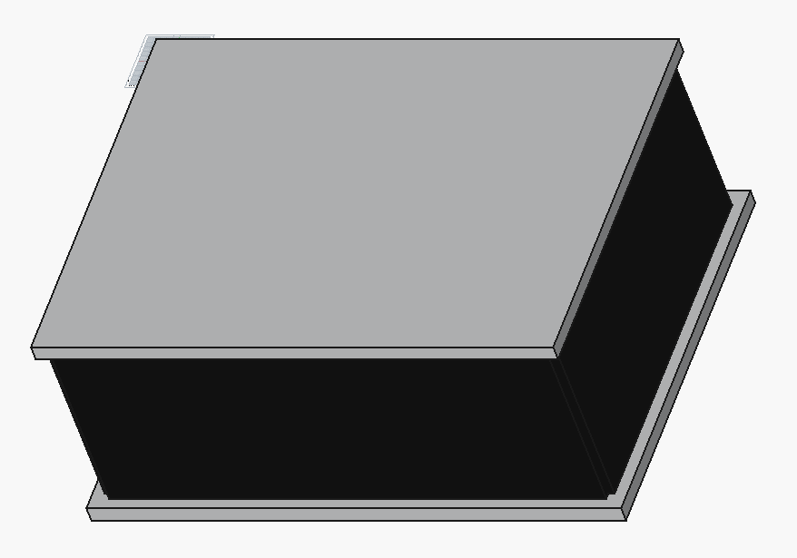

# Blender + Bonsai — BIM / IFC4 Authoring

[Bonsai](https://bonsaibim.org/) (formerly BlenderBIM) is a Blender add-on for open BIM workflows. It uses [IfcOpenShell](https://ifcopenshell.org/) to read and write IFC files. This project uses IfcOpenShell's Python API directly to generate an IFC4 building model.

## Files

### `bim_building.py`

A "Demo Pavilion" IFC4 model with:
- 4 exterior walls (8m × 6m × 3m room)
- Floor slab and roof slab with overhang
- Material assignment (Concrete C30/37)
- Property sets (`Pset_WallCommon` with fire rating, thermal transmittance)
- Full IFC spatial hierarchy: Project → Site → Building → Storey → Elements

**Output:** `bim_building.ifc`

## Screenshot



## IFC Structure

```
IfcProject "CAD Portfolio Demo"
  └── IfcSite "Default Site"
        └── IfcBuilding "Demo Pavilion"
              └── IfcBuildingStorey "Ground Floor"
                    ├── IfcWall "Wall_South"   (+ Pset_WallCommon)
                    ├── IfcWall "Wall_North"   (+ Pset_WallCommon)
                    ├── IfcWall "Wall_East"    (+ Pset_WallCommon)
                    ├── IfcWall "Wall_West"    (+ Pset_WallCommon)
                    ├── IfcSlab "Floor_Slab"
                    └── IfcSlab "Roof_Slab"
```

## Running

```bash
# Standalone (generates .ifc without needing Blender)
pip install ifcopenshell
python bim_building.py

# Then open in Blender with Bonsai
blender
# File → Open IFC Project → select bim_building.ifc
```

## Installing Bonsai

1. Open Blender
2. Edit → Preferences → Get Extensions
3. Press "Allow Online Access"
4. Search "Bonsai" → Install
5. Restart Blender

See: https://docs.bonsaibim.org/quickstart/installation.html

## Dependencies

- `ifcopenshell` (`pip install ifcopenshell`)
- Blender 4.0+ (`sudo dnf install blender`)
- Bonsai add-on (installed via Blender's extension browser)
